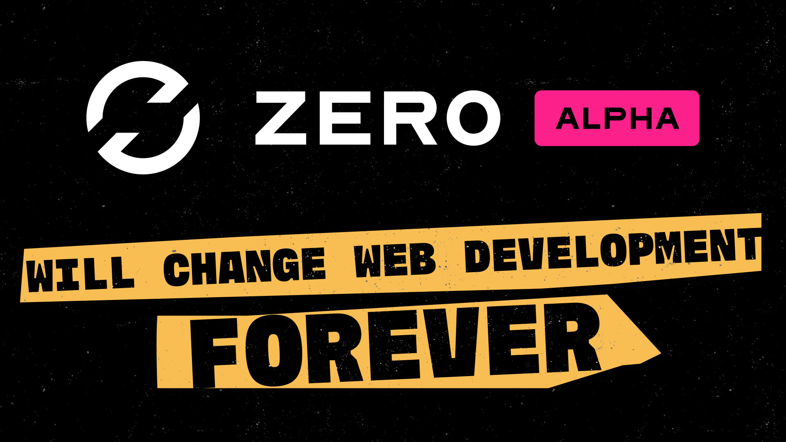

# Zero Svelte

Zero is the local first platform for building incedible, super fast apps.

To use Zero Svelte, you need to follow the Zero docs to get started.

Watch this
[Zero Sync Makes Local First Easy](https://www.youtube.com/watch?v=hAxdOUgjctk&ab_channel=Syntax)

[](https://www.youtube.com/watch?v=hAxdOUgjctk&ab_channel=Syntax)

## Usage

1. Follow [ZERO DOCS](https://zero.rocicorp.dev/docs/introduction) to get started with Zero
1. Install `npm install zero-svelte`
1. Update vite.config.ts to have target 'es2022'.

```ts
import { sveltekit } from '@sveltejs/kit/vite';
import { defineConfig } from 'vite';

export default defineConfig({
	plugins: [sveltekit()],
	optimizeDeps: {
		esbuildOptions: {
			target: 'es2022'
		}
	}
});
```

3. Usage

lib/z.svelte.ts (or whatever you'd like to name)

```ts
// Schema is imported from wherever your Schema type lives.
// via export type Schema = typeof schema;

export const z = new Z()<Schema> {
		server: PUBLIC_SERVER,
		schema,
		userID: 'anon'
		...
	};
```

```svelte
<script lang="ts">
    import { PUBLIC_SERVER } from '$env/static/public';
    import { Query } from 'zero-svelte';
    import { Z } from '$lib/z.svelte'
    import { schema, type Schema } from '../zero-schema.js';

    const todos = new Query(z.current.query.todo);

    const randID = () => Math.random().toString(36).slice(2);

    function onsubmit(event: Event) {
        event.preventDefault();
        const formData = new FormData(event.target as HTMLFormElement);
        const newTodo = formData.get('newTodo') as string;
        const id = randID();
        if (newTodo) {
            z.current.mutate.todo.insert({ id, title: newTodo, completed: false });
            (event.target as HTMLFormElement).reset();
        }
    }

    function toggleTodo(event: Event) {
        const checkbox = event.target as HTMLInputElement;
        const id = checkbox.value;
        const completed = checkbox.checked;
        z.current.mutate.todo.update({ id, completed });
    }
</script>

<div>
    <h1>Todo</h1>
    <form {onsubmit}>
        <input type="text" id="newTodo" name="newTodo" />
        <button type="submit">Add</button>
    </form>
    <ul>
        {#each todos.current as todo}
            <li>
                <input
                    type="checkbox"
                    value={todo.id}
                    checked={todo.completed}
                    oninput={toggleTodo}
                />{todo.title}
            </li>
        {/each}
    </ul>
</div>
```

"todos" here is now reactive and will stay in sync with the persistant db and local data.

Mutations & queries are done with just standard Zero.

```javascript
z.current.mutate.todo.update({ id, completed });
```

See demo for real working code.

See Zero docs for more info.

Listen to [Syntax](Syntax.fm) for tasty web development treats.
